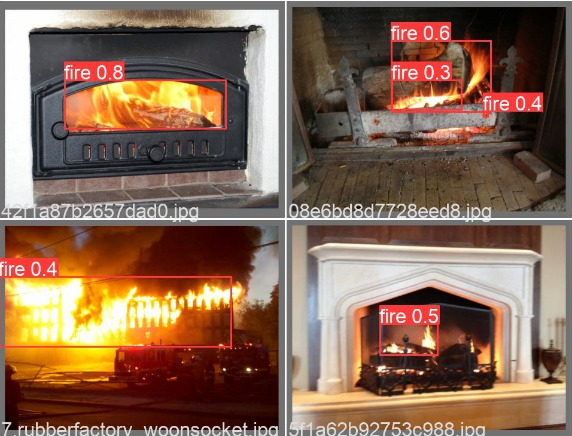

# Yolov5 for Fire Detection

Fire detection task aims to identify fire or flame in a video and put a bounding box around it. This repo includes a demo on how to build a fire detection detector using YOLOv5 and AURDINO UNO. 

### Hardwares Required
 - Aurdino IDE
 - Buzzer
 - Led
 - Aurdino Uno
 - Jumper Wires
 - Breadboard


<p align="center">
  
</p>


## STEPS TO REPLICATE THIS PROJECT:

### 1. Clone the github repository by typing the following commands
```
# Clone
git clone https://github.com/Stebin-17/FIRE-DETECTOR-USING-YOLOv5-AURDINO.git
cd Yolov5-Fire-Detection

# Install yolov5
git clone https://github.com/ultralytics/yolov5  
cd yolov5
pip install -r requirements.txt

```
### 2. Open the link to the dataset in the readme section in the folder. 

  - This dataset contains samples from both [Fire & Smoke](https://www.kaggle.com/dataclusterlabs/fire-and-smoke-dataset) and [Fire & Guns]                                 (https://www.kaggle.com/atulyakumar98/fire-and-gun-dataset) datasets on Kaggle.
  - This will leads to a google drive having zip folder
  - Download the file and paste it inside the folder.
          
### 3. Create a YAML file which contains the path to the dataset, Training & Validation and specific the number of classes and class names

  - This has been done in a file called fire_config.yaml.
  - open and change the path according to your dataset destination.
  
      ```bash
    ├── dataset
    │   └── fire
    │       ├── train
    │       │     ├── images
    │       │     └── labels
    │       │ 
    │       └── val
    │             ├── images
    └──           └── labels
    ```
 
  
### 4. Train the model using the command given below

  - Open ```train.ipynb``` script for training the model from scratch. 
    ```
    python train.py --img 640 --batch 16 --epochs 10 --data ../fire_config.yaml --weights yolov5s.pt --workers 0
    ```
### 5. Prediction
   - After training done the results would be obtained in the runs folder
   - open he folder and locate the weights for the current experiment
   - Copy the folder path and paste in the ```--weight``` section given below
   - While runnning this code make the port of the uno connected to the usb so that the error does't occurs
   - General options for detect.py
      
      ```
      python detect.py --weights yolov5s.pt --source 0                               # webcam
                                                     img.jpg                         # image
                                                     vid.mp4                         # video
                                                     screen                          # screenshot
                                                     path/                           # directory
                                                     list.txt                        # list of images
                                                     list.streams                    # list of streams
                                                     'path/*.jpg'                    # glob
                                                     'https://youtu.be/Zgi9g1ksQHc'  # YouTube
                                                     'rtsp://example.com/media.mp4'  # RTSP, RTMP, HTTP stream
                                                     
                                                     
      python detect.py --weights yolov5s.pt                 # PyTorch
                                 yolov5s.torchscript        # TorchScript
                                 yolov5s.onnx               # ONNX Runtime or OpenCV DNN with --dnn
                                 yolov5s_openvino_model     # OpenVINO
                                 yolov5s.engine             # TensorRT
                                 yolov5s.mlmodel            # CoreML (macOS-only)
                                 yolov5s_saved_model        # TensorFlow SavedModel
                                 yolov5s.pb                 # TensorFlow GraphDef
                                 yolov5s.tflite             # TensorFlow Lite
                                 yolov5s_edgetpu.tflite     # TensorFlow Edge TPU
                                 yolov5s_paddle_model       # PaddlePaddle
      ```

   - If you train your own model, use the following command for detection:
      ```
      python detect.py --source ../input.mp4 --weights runs/train/exp/weights/best.pt --conf 0.2
      ```
   
   - Or you can use the pretrained model located in ```models``` folder for detection as follows:
      ```
      python detect.py --source ../input.mp4 --weights ../models/best.pt --conf 0.2
      ```
### 6. Linking with the IOT part
  - The detect.py is modified in such a way that whenever the fire is detected along with that a serial message is passed to the aurdino board 
  - Based on the message the ino file is written in such a way to respond to these signals and act accordingly.
  - Open the Aurdino IDE and copy the ino code to the IDE in the ```/Aurdino/early_fire/early_fire.ino```


### IOT-DIAGRAM:

In this project Aurdino uno board has been used for obtaining the output. The circut diagram is shown below as:

+ Connect the 13 pin of the aurdino board to the led
+ Connect the other end to the ground
+ Connect the 8 pin to to the buzzer 
+ COnnect the other end to the ground


### OUTPUT:
- The output obtained from this overall project is being given in the following link:-
  ___https://drive.google.com/file/d/1sIE28ReSW0fYNjWC1fpiZAdgjedDVWcm/view?usp=sharing___

### Prediction Results
The fire detection results were fairly good even though the model was trained only for a few epochs. However, I observed that the trained model tends to predict red emergency light on top of police car as fire. It might be due to the fact that the training dataset contains only a few hundreds of negative samples. We may fix such problem and further improve the performance of the model by adding images with non-labeled fire objects as negative samples. The [authors](https://github.com/ultralytics/yolov5/wiki/Tips-for-Best-Training-Results) who created YOLOv5 recommend using about 0-10% background images to help reduce false positives. 

| Ground Truth | Prediction | 
| :-: | :-: |
|  |  |
|  |  | 

### REFERENCE:
https://www.hackster.io/innovation4x/early-fire-detection-using-ai-dd27bf
